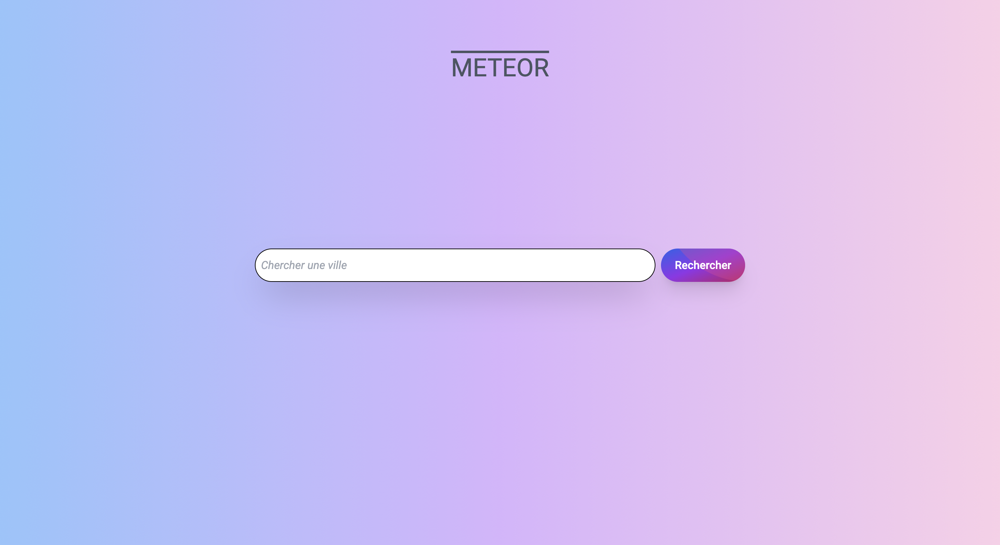
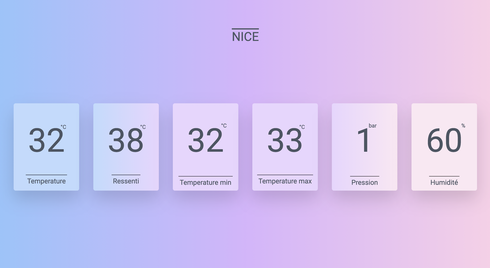

# Meteor app

## Table of contents

- [Overview](#overview)
  - [The App](#the-app)
  - [What it looks like](#what-it-looks-like)
  - [How to run the app ?](#how-to-run-the-app)
- [My process](#my-process)
  - [Built with](#built-with)
  - [What I learned](#what-i-learned)
  - [Continued development](#continued-development)

## Overview

### The App

Meteor is an app that lets you check weather data for any given city.

### What it looks like

Right after browsing the website you land in the homepage : 



After browsing a location, the data is displayed as follow : 



### How to run the app ? 

- Get your `API_KEY` on: https://openweathermap.org/api
- Verify your email (otherwise your API key won't work)
- If the API returns 401, your key is probably not activated yet. Within the next couple of hours it will be activated and ready to use (https://openweathermap.org/faq#error401)
- Put your key in a `.env` file like `.env.example`: `REACT_APP_API_KEY=XXXX`

Then clone the project, jump into your command line and run these : 

```bash
# install dependencies
yarn

# start the application
yarn start

# open the application in the browser
open http://localhost:3000
```

## My process

### Built with

- Semantic HTML5 markup
- Flexbox
- [React](https://reactjs.org/) - JS library
- [Typescript](https://www.typescriptlang.org/) - JS with an emphasis on types
- [Tailwind CSS](https://tailwindcss.com/) - For styles

### What I learned

- Creating custom Typescript interface like so : 

```ts
interface Weather {
	id: number, 
	main: string, 
	description: string, 
	icon: string
}
export interface Main {
	clouds: {
		all: number
	}
	main: {
		feels_like : number,
		humidity: number,
		pressure: number,
		temp: number,
		temp_max: number,
		temp_min: number
	}
	rain: {
		'1h': number
	}
	weather: Array<Weather>
}
```

- Creating functions that convert kelvin to celsius or even hectopascal to bar : 

```ts
const DataDisplay: React.FC<Props> = ({data, city}) => {
  const kelvinToCelsius = (x: number | undefined) => {
    if (x !== undefined) return Math.round(x-273.15)
 }
const hectopascalToBar = (x: number | undefined) => {
  if (x !== undefined) return Math.round(x/1000)
}
```

- Preventing undefined type errors by adding one more layer of verification within my code : 
```ts
kelvinToCelsius(data?.main.temp_max)
```
Here the ``` kelvinToCelsius``` function will be executed only if data exist (thus is not undefined). This is thanks to the "?" syntax.

- Automatically scrolling in a given place of my webpage by clicking on a button : 

```ts
const scrollToDataDisplay = () => {
  window.scrollTo({
    top: window.outerHeight, 
    behavior: 'smooth'
  })
}
```

- Prevent the scrolling to empty data if the user's request remains unanswered : 

```ts
	useEffect(() => {
		if (!weatherData) return
		scrollToDataDisplay()
	}, [weatherData])
```

If no data is found, the page won't scroll down to the "data-display" section. If there is data the page will automatically scroll to the section where the data is displayed. This process will repeat itself everytime that the data changes, thus everytime that the user submit a new location, thank to : 

 ```useEffect(()=>{}, [weatherData])``` 

- Displaying component on boolean conditions : 

The component ```DataDisplay``` will appear only if the weather data of the given location exists (thus not undefined) : 

```ts
  return(
    <div className='h-max flex flex-col bg-gradient-to-r from-blue-300 via-purple-300 to-pink-200'>
      <h1 className="flex justify-center mt-20 text-4xl text-gray-600 font-roboto overline">METEOR</h1>
      <InputField city={city} setCity={setCity} handleFormSubmit={handleFormSubmit}/>
      {weatherData && <DataDisplay data={weatherData} city={city}/>}
    </div>
  )
``` 

### Continued development

I will code a responsive form of the website in the near future.
